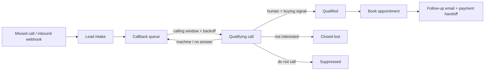

# core-dispatch

**An open-source framework for AI voice-dispatch workflows.** Turn a missed call into a booked job: intake the lead, schedule compliant callbacks, qualify the conversation, book, and follow up, all on top of provider adapters you can swap out.

[](https://github.com/redzicdenis08-afk/core-dispatch/actions/workflows/ci.yml)
[](LICENSE)
[](https://www.python.org/)
[](https://github.com/astral-sh/ruff)

The architecture here is drawn from a production voice-dispatch system for local service businesses. This repository is a clean, dependency-free **framework implementation** of those patterns. The live deployment (real prompts, customer data, provider keys) stays private; what is open here is the reusable engine and the blueprint.

## The lifecycle



## Why

If you run AI voice agents for outbound or missed-call workflows, the glue between "a call happened" and "a job got booked" is where everything leaks: callbacks fired outside legal hours, leads re-dialed forever or dropped after one try, do-not-call requests ignored, qualified callers never followed up. core-dispatch is the small, readable engine that makes that lifecycle explicit and testable, without locking you to any one voice or payment vendor.

Zero runtime dependencies. Pure standard library. Runs end to end offline with the bundled in-memory adapters.

## Install

```bash
pip install -e .            # from source
pip install -e ".[dev]"     # with test + lint tooling
```

## Quickstart

### Run a simulation

```bash
coredispatch simulate examples/leads.json
```

```
LEAD      STAGE
------------------------------
lead_001  follow_up
lead_002  callback_queued
lead_003  closed_lost
lead_004  do_not_contact

4 leads | 1 booked
```

### Use it as a library

```python
from datetime import datetime
from coredispatch import Dispatcher, Lead
from coredispatch.adapters.memory import (
    InMemoryLeadStore, ScriptedVoiceProvider, KeywordQualifier,
    ConsoleNotifier, InMemoryCalendar, MockPaymentProvider,
)
from coredispatch.models import CallOutcome

store = InMemoryLeadStore()
dispatcher = Dispatcher(
    store=store,
    voice=ScriptedVoiceProvider({"l1": (CallOutcome.HUMAN_REACHED, "how much? let's do it")}),
    qualifier=KeywordQualifier(),
    notifier=ConsoleNotifier(),
    calendar=InMemoryCalendar(),
    payments=MockPaymentProvider(),
)

lead = Lead(id="l1", name="Mike", phone="+15550000001", email="mike@example.com")
dispatcher.intake(lead, now=datetime.now())
dispatcher.run_callback(lead, now=datetime.now())
print(store.get("l1").stage)   # DispatchStage.FOLLOW_UP
```

## Bring your own providers

The dispatcher depends only on small protocols, never on a vendor. Implement these against whatever you use:

| Adapter | Responsibility | Example backends |
|---|---|---|
| `VoiceProvider` | place a call, return outcome + transcript | VAPI, Twilio, Retell, Bland |
| `Qualifier` | decide if a reached human is qualified | keyword baseline, or an LLM |
| `LeadStore` | persist and fetch leads | Postgres, SQLite, a sheet |
| `Calendar` | book a slot | Cal.com, Google Calendar |
| `PaymentProvider` | create a checkout link | Stripe, Gumroad |
| `Notifier` | send email | Resend, SES, Postmark |

The bundled `coredispatch/adapters/memory.py` has in-memory reference implementations so the whole thing runs with no external services. Use them as the template for your real adapters.

## Compliant callbacks

`CallbackQueue` enforces three things every voice operation needs:

- **Calling windows:** callbacks only land inside allowed local-time windows. The defaults are conservative placeholders; set windows that match your jurisdiction (for example, TCPA rules in the US).
- **Attempt caps:** a lead is never dialed more than `max_attempts` times.
- **Backoff:** the gap between attempts grows (`1h, 4h, 24h, 72h` by default).

## Webhooks and security

`coredispatch/webhooks.py` shows the safe way to ingest provider events: verify the HMAC signature before trusting a body (`verify_signature`), then parse defensively (never trust field presence or types from the wire). Secrets are referenced by environment-variable name through `DispatchConfig`, never stored in config or code. See [SECURITY.md](SECURITY.md).

## Project layout

```
coredispatch/
  models.py        # Lead, CallResult, Appointment, stage + outcome enums
  callbacks.py     # CallWindow, CallbackQueue (windows + backoff + caps)
  dispatcher.py    # the lifecycle state machine
  webhooks.py      # signature verification + defensive event parsing
  config.py        # env-referenced secrets, never stored
  cli.py           # `coredispatch simulate`
  adapters/        # provider protocols + in-memory reference impls
tests/             # full test suite
examples/          # runnable sample leads
docs/              # architecture and adapter guides
```

## Roadmap

- [ ] Reference VAPI and Twilio voice adapters
- [ ] SQLite-backed `LeadStore`
- [ ] Async dispatcher for high-volume fleets
- [ ] Pluggable LLM `Qualifier`
- [ ] Metrics export (per-campaign booked/closed rollups)

## Contributing

Issues and PRs welcome. See [CONTRIBUTING.md](CONTRIBUTING.md). Run the tests with `pytest`, or with zero dependencies via `python tests/test_coredispatch.py`.

## License

[MIT](LICENSE) © Denis Redzic
